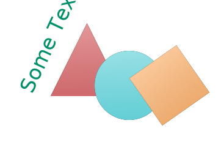

# Week 6

## Professional

* [react native vs. flutter](https://www.reddit.com/r/reactnative/comments/kv05zj/why_choose_react_native_and_not_flutter_in_2021/) = seems flutter is easier and more performant; native has a much bigger community & you can write also for the web at the same time

# Week 5

## Philosophy

* hamartia = the original word for sin = archery term meaning missing the mark; hamartiology = one of the things that a religion tries to explain: what is wrong with us humans

* Bertrand Russel = philosophy is the no-man's-land between religion and philosophy 
  - the circumstances in one's life determine their philosophy; and their philosophy determines their circumstances

* Adorno - against entertainment; in our free time we should aim to become better persons; https://elrumo.medium.com/walt-disney-the-most-dangerous-american-in-history-b099a16a462d

* series of books that i just learned about: Oxfort Very Short Introduction & Cambridge Companion; I'd like to give a try to some of them when I find the time

* why does the devil have horns? he took them from pan (https://www.quora.com/When-was-the-devil-first-depicted-with-horns)

* sartre: what if we choose our friends in such a way as to reinforce the story we like to tell ourselves about ourselves? 

* when somebody asks you who you are? what do you answer? the sum total of the stories you tell yourself matters? could you feel better about yourself if you choose a different subset of stories about yourself? probably it would pay off to take time and think about the right stories to tell and re-tell; a bit like the jewish patriarchs would tell their best stories, and we ended up learning them ourselves; but are you cheating if you're only focusing on the good stories? 

# Week 4

## Software Engineering

* Golzadeh et al. - Rise and Fall of GHActions - https://e1.pcloud.link/publink/show?code=XZsrcFZXPvoKfud5xzpepl3ryJA6YriEIi7

## Philosophy

* Heidegger = **dasein** (literally, being-there): *being and the world are one single thing*; sometime you have to invent a new word to explain a new concept; , dasein
  - [philosophise this guy](https://www.philosophizethis.org/transcript/episode-101-transcript): H thinks that *at our core, we are ontological beings* ; against H, John Dewey: "don't complain that we abuse nature; the alternative is that nature abuses us; look at your ancestors"; 
  - if we start looking at the world only from the POV of how can we use it; and everything is one, so other humans are also part of the world; we might risk looking at them from the pov of how could we use them; reminds me of Kant: every human being is *an end in themselves* 
  - how to study being? start with a phenomenological approach by stdudying  what is *like* to be a human being
  - a *dasein* - ontological being constantly engaged in tasks taht they care about; which reminds me of discussions about how intelligence can't be separated by it's embodyment

## Teaching

* tacit knowledge transmission is higher-bandwidth than explicitly explaining stuff
  - .. powerful moment when students realize teacher actually doesn't know why a bug is happening, and they can genuinely debug together as a normal part of the creative process

* for the future: debugging as a topic
  - Perhaps ironically, I often find debugging a tricky bug to be way more fun than other parts of programming. Hard enough to feel rewarding, easy enough to be tractable, and there's a tangible benefit from solving the mystery. Sort of a chance to do science on easy mode.
  - Geoffrey Litt @geofreylitt

## Personal

* pay more attention to how you dress and present yourself - would it hurt you if you presented like this? https://ddsks.dk/en/ansatte/rasmus-olme

* and embedding links in an embedded svg file: 

* added the `cape` aias == commit-and-push-w/-empty-message...

Other

* macbook stand/holder? https://www.apple.com/dk/shop/product/HA244ZM/B/twelve-south-hirise-justerbar-holder-til-macbook-pro-og-macbook-air

* streamdeck - led keyboard that's programmable? 

# Week 1

* David Hume - Scottish Enlightenment
	* a skeptical guy who was also jolly; reminds me of Niko; ("Poor David Hume is dying fast, but with real cheerfulness and good humor and with real resignation to the necessary course of things", Adam Smith)
	* Excellent at spotting assumptions (e.g. the argument of the great watchmaker; you are assuming you can make a comparison between a watch and a universe; you are assuming that there had to be a creator - could have been many causes; could have been many universes; you are finally assuming that the creator is your god; could be any of the othe ones; also, you are assuming it's one god; but could have been a committee, e.g.)
	* if we accept the existence of an intelligent designer, what have we accepted the existence of? if we accept the existence of a soul, what have we accepted the existence of? if it's eternal, what makes you think it wasn't there before?
	* and if human intelligence needed a designer, who designed the intelligence of the designer? 
	* "When anyone tells me, that he saw a dead man restored to life, I immediately consider with myself, whether it be more probable, that this person should either deceive or be deceived, or that the fact, which he relates, should really have happened."
	* "A wise man always proportions his belief to the evidence."

 
* Thomas Hobbes, Leviathan
	* state of nature - no property; it's not that you don't have anything; it's worse; it's that everything belongs to everybody; and everything is constantly up for grabs; 
	* without a Leviathan, a strong state, there is no guarantee of anybody respecting the social contract
	* there is no "injustice" when no laws are put in place. Whether something is "good" or "bad" or "right" or "wrong" really only is present when there is a goal that is trying to be achieved
	* if you're one of the people that think that deep down, humans are good Hobbes would say: why lock the door at night? 

	>  "In such condition there is no place for industry, because the fruit thereof is uncertain: and consequently no culture of the earth; no navigation, nor use of the commodities that may be imported by sea; no commodious building; no instruments of moving and removing such things as require much force; no knowledge of the face of the earth; no account of time; no arts; no letters; no society; and which is worst of all, continual fear, and danger of violent death; and the life of man, solitary, poor, nasty, brutish, and short"

	
	* Humans eventually realize in this state of nature is that they could achieve a higher level of self-preservation, that is, a life without all of this constant looking over your shoulder and uncertainty, they could achieve that life if they could eliminate this threat of other humans.
	* Government is a necessary evil
	* Because we are reasoning creatures, that if we use our ability to reason and think about what behavior would yield the greatest quality of self-preservation, we naturally arrive at certain principles. This is why the collection of them is aptly named "Natural Law". 
	* The sovereign. The leader with absolute authority to do whatever he wants, whenever he wants in the interest of maintaining the contract. 
		* While in the state of nature, we have complete control over our lives to go where ever we want, take what ever we want, kill whoever we want, but 
		* when we sign the social contract, which is without question a more self-preserving lifestyle, we forfeit much of that control over what we can do to the sovereign. 
		* His job, is to keep us OUT of that terrible, perpetual state of war that we would otherwise find ourselves in. 
		* The laws the sovereign puts in place in the interest of keeping us OUT of a perpetual state of war ARE the moral order that you are beholden to. 
		* Because the sovereign is the moral authority, it doesn't matter how tyrannical or seemingly terrible he is to you, no matter how bad it is he is still keeping you out of the state of nature, which is without question, much worse for you.

 
 

